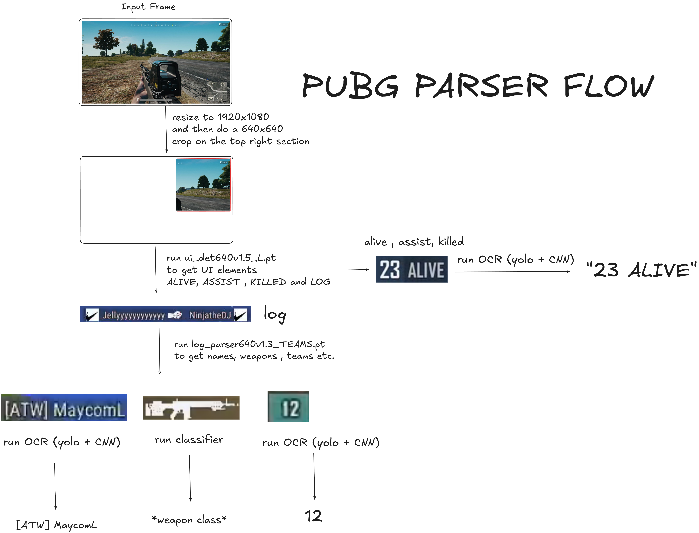

# pubg_parser

## 1. overview 
this project is meant to parse logs from pubg streams , to get information such as  player name, weapons etc.

## 1.1 project structure
here are the `important` folders
|folder name| description |
|---|---|
| airflow_deploy | docker deployment for airflow |
| autolabel_server | server for generating bounding box annotations |
| char_classifier | notebooks for training character classifier |
| label_studio_converter | notebooks for various conversions from labelstudio to labelme json | 
| label_studio_docker | docker deployment for labelstudio | 
| notebooks | various notebook experiments | 
| ocr_server | old ocr server using PaddleOCR and GOT2 | 
| ocr_serverCNN | current ocr server using CNN |
| pixel_filter | notebook for training a CNN model for classifiying whether or not the detected name is usable |
| stream_saver | utility for saving streams from twitch |
| utils | various utilities that dont exactly fit anywhere else |
| weapons_classifier |  notebook for training a CNN model for classifiying weapons classes |
| webui | gradio webui demo |

## 1.2 models 
latest models can be found on the releases page [here](https://github.com/vidparser77/pubg_parser/releases/tag/v1-pre)
|model name| architecture | input_size | description | 
|---|---|---|---|
| char_classifierv1.7_224.pth | ResNet34 | 224x224 |  classifier for individual pubg characters |
| ui_det640v1.5_L.pt | yolo11l | 640x640 | bounding box detector for UI elements |
| log_parser640v1.3_TEAMS.pt | yolo11m | 640x640 | bounding box detector for parsing kill logs |
| pixel_filter1.0.pth | ResNet18 | 224x224 | classifier for detected names , whether they are too pixelated to be used with the character classifier|
| pubg_char_detv1.2.pt | yolo11n | 224x224 | text detector for cropped names from log parser |
|weapon_classifierv1.0.pth | ResNet34 | 224x224 | weapons classifier for weapons in kill logs |

## 2. program flow

